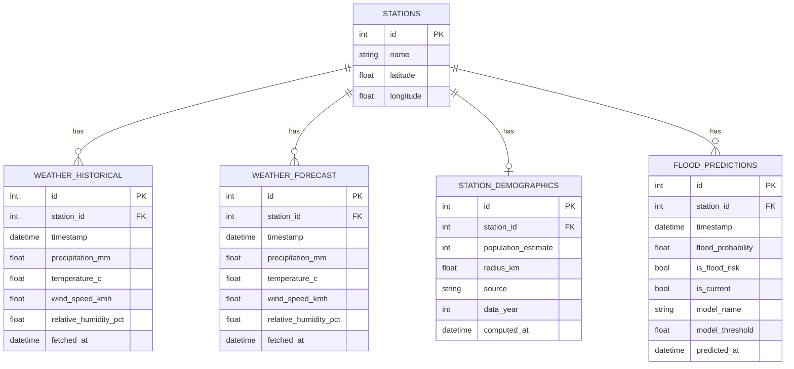

# Flood Guard — API Documentation

A flood early-warning backend for Kampala, Uganda. It ingests weather and
population data, runs a trained ML model to predict flood risk, and serves
all of it through a REST API — this document is the reference for building
a frontend against that API.

## Quick Reference

| | |
|---|---|
| **Live API** | https://flood-gaurd-backend.onrender.com |
| **Interactive docs (Swagger)** | https://flood-gaurd-backend.onrender.com/docs |
| **GitHub repository** | https://github.com/free-dever/flood-gaurd-backend |
| **Hosting** | [Render](https://render.com) — Web Service, free tier, Frankfurt region |
| **Scheduled jobs** | [GitHub Actions](https://github.com/free-dever/flood-gaurd-backend/actions) — see [Part 1.5](#15-orchestration--keeping-data-fresh) |

> **Free-tier cold start**: the Render service spins down after inactivity. The
> *first* request after a quiet period can take 30-50+ seconds while it wakes
> up. Don't treat that as broken — it's normal, and every request after is fast.

> **⚠ No CORS configured yet.** The FastAPI app currently has no
> `CORSMiddleware`. If you build a browser-based frontend (React, Vue, plain
> JS) hosted on a different origin than the API, requests **will be blocked
> by the browser** until CORS is added. This is a known gap, not something
> you're doing wrong — flag it when you're ready to build the frontend and
> it's a small fix.

---

# Part 1 — Architecture & Data Flow

The system is a pipeline: data comes in from external sources, lands in one
Postgres database, gets turned into predictions, and everything is served
back out through one API. This section follows that flow start to finish.

```
  Open-Meteo API          WorldPop API
       │                        │
       ▼                        ▼
 weather_fetcher      demographics_fetcher
       │                        │
       └───────────┬────────────┘
                    ▼
          Neon PostgreSQL (single source of truth)
                    │
                    ▼
             model_service
        (reads weather, writes predictions)
                    │
                    ▼
          Neon PostgreSQL (updated)
                    │
                    ▼
              FastAPI (this API)
                    │
                    ▼
             Frontend (you)
```

The whole left-hand side (fetchers + model_service) is orchestrated
automatically on a schedule — see [1.5](#15-orchestration--keeping-data-fresh).
The frontend only ever talks to the FastAPI layer on the right; it never
touches the database or the model directly.

## 1.1 Data Sources

| Source | Used by | Provides | Auth required |
|---|---|---|---|
| [Open-Meteo Archive API](https://open-meteo.com/) | `weather_fetcher` | Historical hourly weather (ERA5-based) | None — free |
| [Open-Meteo Forecast API](https://open-meteo.com/) | `weather_fetcher` | 7-day hourly weather forecast | None — free |
| [WorldPop Stats API](https://www.worldpop.org/) | `demographics_fetcher` | Population estimate within a radius of a point | None — free |

Both are free, public APIs with no keys — nothing for a frontend dev to
provision here; they're only called by the backend's own scheduled jobs.

## 1.2 Fetchers — Data Ingestion

### Weather Fetcher (`weather_fetcher/`)

For each of the 4 monitoring stations, pulls two things from Open-Meteo and
writes them to Postgres:

| Fetch | Window | Table written | Write behavior |
|---|---|---|---|
| Historical | Past 30 days, hourly | `weather_historical` | **Append-only** — new rows inserted, duplicates skipped |
| Forecast | Next 7 days, hourly | `weather_forecast` | **Fully replaced** every run — old rows deleted, fresh ones inserted |

Variables fetched per hour: `precipitation_mm`, `temperature_c`,
`wind_speed_kmh`, `relative_humidity_pct`.

> The historical archive has a ~1-day lag (Open-Meteo limitation) — its
> newest row is always yesterday, never "right now." The forecast fetch is
> what actually covers today onward. This matters later for how "current"
> predictions are defined.

### Demographics Fetcher (`demographics_fetcher/`)

For each station, builds a 1km-radius circular polygon around its
coordinates, sends it to the WorldPop stats API, and **upserts** the
resulting population estimate into `station_demographics` (one row per
station, updated in place on re-run — not append-only).

**Cadence: manual, run by hand roughly once a year.** Population data
changes far too slowly to justify automation, so — unlike the weather
fetcher — this one isn't part of the scheduled pipeline.

## 1.3 Database — Neon PostgreSQL

One Postgres database (hosted on [Neon](https://neon.tech), serverless) is
the single source of truth for everything. Five tables:



| Table | Purpose | Write pattern |
|---|---|---|
| `stations` | The 4 monitoring locations — single source of truth for station identity | Seeded once, rarely changes |
| `weather_historical` | Observed hourly weather, 30-day rolling window | Append-only, deduped |
| `weather_forecast` | Forecast hourly weather, next 7 days | Fully replaced every fetcher run |
| `station_demographics` | Population estimate per station's flood zone | Upserted (manual, ~yearly) |
| `flood_predictions` | Model-predicted flood risk, current + next 7 days | Fully replaced every prediction job run |

### The 4 stations

| id* | name | latitude | longitude |
|---|---|---|---|
| — | `kampala_city_centre` | 0.3476 | 32.5825 |
| — | `nakivubo_channel` | 0.3167 | 32.5833 |
| — | `lubigi_wetland` | 0.3333 | 32.5333 |
| — | `bwaise` | 0.3417 | 32.5564 |

\* IDs are assigned by the database and **not guaranteed to be 1-4** —
always fetch `GET /stations` to get real IDs rather than hardcoding them.

### `flood_predictions.is_current`

This is the one column worth understanding specifically: every prediction
job run writes **one row per hour** from "now" through 7 days ahead for
each station, all in this same table. `is_current = true` marks the single
row for "now"; everything else is forecast. The API's two prediction
endpoints ([1.6](#get-predictionsstation_id)) just filter on this flag —
there's no separate "current" table.

## 1.4 Model Service — Predictions

`model_service/` runs as a batch job (not a live inference API — see
[1.5](#15-orchestration--keeping-data-fresh)) that turns stored weather
data into stored predictions.

**Reads**, per station:
- Last 48 hours from `weather_historical` (context only — needed to compute
  rolling-window features for the first forecast hours, not part of the output)
- All rows currently in `weather_forecast`

**Computes**, per hour: rolling precipitation features —
`precip_3h`, `precip_6h`, `precip_12h`, `precip_24h`, `max_precip_1h_in_6h`,
plus `relative_humidity_pct` and `month`. These are the exact features the
model was trained on ([Part 2](#part-2--development-timeline) has the
training details).

**Model served**: LightGBM (`model_service/models/lightgbm.joblib`) — the
best-performing of 4 models compared during training. Predictions are
thresholded at a tuned cutoff (~0.406, optimized for recall since missing a
real flood matters more than a false alarm) to produce `is_flood_risk`.

**Writes**: `flood_predictions`, fully replacing that station's rows each
run — typically 168 rows (1 current + 167 forecast hours).

> All 4 stations get predictions, even though the model was trained only on
> `kampala_city_centre`'s weather data — the 4 stations sit within ~5km of
> each other, so one weather pattern is treated as representative of all of
> them.

## 1.5 Orchestration — Keeping Data Fresh

Two pieces tie the fetchers and model service together into an automated
system:

**`run_pipeline.py`** (repo root) — runs, strictly in order:
1. `weather_fetcher` (all 4 stations, historical + forecast)
2. `model_service` (all 4 stations) — **only if step 1 fully succeeded**

If the weather fetch fails partway through, the prediction step is skipped
entirely rather than computing predictions from stale/incomplete weather
data.

**GitHub Actions** (`.github/workflows/pipeline.yml`) — runs
`run_pipeline.py` on a schedule, in a fresh temporary environment, with no
local machine involved:

| | |
|---|---|
| Schedule | `03:00` and `15:00` UTC (`06:00` / `18:00` EAT) |
| Manual trigger | Yes — Actions tab → "Flood Guard Pipeline" → "Run workflow" |
| Secrets | `DATABASE_URL` (Neon connection string), stored as an encrypted GitHub secret |

Reliability notes worth knowing: requests to Open-Meteo have a 60s timeout,
auto-retry up to 3 times with backoff on transient failures, and a 3-second
pause between each station to avoid triggering upstream throttling — all
tuned after real failures during setup.

| Job | Cadence | Automated? |
|---|---|---|
| Weather + predictions (`run_pipeline.py`) | 2x/day | Yes — GitHub Actions |
| Demographics (`demographics_fetcher/run.py`) | ~Yearly | No — run manually |

## 1.6 FastAPI — Endpoints

Stack: FastAPI + SQLAlchemy + Pydantic, serving directly from the Postgres
tables above. No authentication currently required on any endpoint.

**All timestamps are UTC, ISO 8601** (e.g. `"2026-07-15T00:00:00Z"`).
**All errors** follow FastAPI's standard shape: `{"detail": "message"}`,
with an appropriate HTTP status code.

### Endpoint summary

| Method | Path | Description |
|---|---|---|
| GET | `/health` | Liveness check |
| GET | `/stations` | List all monitoring stations |
| GET | `/stations/{station_id}` | Get one station |
| GET | `/stations/{station_id}/demographics` | Population estimate for a station |
| GET | `/weather/{station_id}` | Latest observed weather (current conditions) |
| GET | `/weather/{station_id}/history?start_date=&end_date=` | Historical weather in a date range |
| GET | `/weather/{station_id}/forecast` | 7-day hourly weather forecast |
| GET | `/predictions/{station_id}` | Current flood-risk prediction |
| GET | `/predictions/{station_id}/forecast` | 7-day hourly flood-risk forecast |

---

#### `GET /health`

No parameters. Confirms the API is reachable.

```json
{ "status": "ok" }
```

---

#### `GET /stations`

Returns all 4 stations.

```json
[
  { "id": 2, "name": "kampala_city_centre", "latitude": 0.3476, "longitude": 32.5825 },
  { "id": 3, "name": "nakivubo_channel", "latitude": 0.3167, "longitude": 32.5833 },
  { "id": 4, "name": "lubigi_wetland", "latitude": 0.3333, "longitude": 32.5333 },
  { "id": 5, "name": "bwaise", "latitude": 0.3417, "longitude": 32.5564 }
]
```

#### `GET /stations/{station_id}`

```json
{ "id": 2, "name": "kampala_city_centre", "latitude": 0.3476, "longitude": 32.5825 }
```

**Errors**: `404` if `station_id` doesn't exist.

---

#### `GET /stations/{station_id}/demographics`

```json
{
  "station_id": 2,
  "population_estimate": 15234,
  "radius_km": 1.0,
  "source": "worldpop",
  "data_year": 2020,
  "computed_at": "2026-06-15T10:00:00Z"
}
```

**Errors**: `404` if the station doesn't exist, or if demographics haven't
been computed for it yet (run `demographics_fetcher/run.py`).

---

#### `GET /weather/{station_id}`

The single most recent historical observation — "current conditions."

```json
{
  "id": 4488,
  "station_id": 4,
  "timestamp": "2026-07-14T23:00:00Z",
  "precipitation_mm": 0.0,
  "temperature_c": 20.7,
  "wind_speed_kmh": 5.2,
  "relative_humidity_pct": 88.0,
  "fetched_at": "2026-07-15T06:30:36.439695Z"
}
```

**Errors**: `404` if the station doesn't exist, or no weather data has been
fetched yet for it.

---

#### `GET /weather/{station_id}/history?start_date=YYYY-MM-DD&end_date=YYYY-MM-DD`

Both query params required. Returns hourly records, oldest first.

```json
[
  { "id": 101, "station_id": 2, "timestamp": "2026-07-01T00:00:00Z", "precipitation_mm": 0.2, "temperature_c": 19.4, "wind_speed_kmh": 3.1, "relative_humidity_pct": 91.0, "fetched_at": "2026-07-14T06:00:00Z" }
]
```

**Errors**: `404` station not found · `422` `start_date` after `end_date`,
or a param missing.

---

#### `GET /weather/{station_id}/forecast`

Up to 168 rows (7 days × 24h), oldest first.

```json
[
  { "id": 890, "station_id": 2, "timestamp": "2026-07-15T00:00:00Z", "precipitation_mm": 1.1, "temperature_c": 21.0, "wind_speed_kmh": 8.4, "relative_humidity_pct": 85.0, "fetched_at": "2026-07-15T06:30:36.439695Z" }
]
```

**Errors**: `404` if the station doesn't exist.

---

#### `GET /predictions/{station_id}`

The current flood-risk assessment — the model's output for "now."

```json
{
  "id": 2689,
  "station_id": 2,
  "timestamp": "2026-07-15T00:00:00Z",
  "flood_probability": 0.0175,
  "is_flood_risk": false,
  "model_name": "LightGBM",
  "model_threshold": 0.4059,
  "predicted_at": "2026-07-15T07:32:32.443276Z"
}
```

`flood_probability` is a 0-1 score; `is_flood_risk` is that score compared
against `model_threshold` (already computed server-side — a frontend
doesn't need to apply the threshold itself).

**Errors**: `404` if the station doesn't exist, or no prediction has been
computed yet (run `model_service/run.py`).

---

#### `GET /predictions/{station_id}/forecast`

Upcoming hourly predictions, oldest first. **Row count is not fixed** —
hours with incomplete underlying weather data are silently skipped, so
expect somewhere between 1 and 167 rows, not always exactly 167.

```json
[
  { "id": 2690, "station_id": 2, "timestamp": "2026-07-15T01:00:00Z", "flood_probability": 0.76, "is_flood_risk": true, "model_name": "LightGBM", "model_threshold": 0.4059, "predicted_at": "2026-07-15T07:32:32.443276Z" }
]
```

**Errors**: `404` if the station doesn't exist.

## 1.7 Deployment

| Component | Where | Notes |
|---|---|---|
| API (FastAPI) | [Render](https://render.com) Web Service | Free tier, Frankfurt region, native Python 3 runtime (not Dockerized yet) |
| Database | [Neon](https://neon.tech) serverless Postgres | Connection string in `DATABASE_URL`, never committed to git |
| Scheduled jobs | [GitHub Actions](https://github.com/free-dever/flood-gaurd-backend/actions) | Free — chosen over Render's paid Cron Jobs |
| Source | [github.com/free-dever/flood-gaurd-backend](https://github.com/free-dever/flood-gaurd-backend) | `main` branch, auto-deploys to Render on push |

---

# Part 2 — Development Timeline

For context on how the system reached this shape (secondary to the
architecture above — a frontend dev mainly needs Part 1):

| Stage | What was built |
|---|---|
| 1. Foundation | `stations`, `weather_historical`, `weather_forecast` tables · `weather_fetcher` · FastAPI `/stations` and `/weather` endpoints |
| 2. Demographics | `station_demographics` table · `demographics_fetcher` (WorldPop) · `/stations/{id}/demographics` |
| 3. ML data prep | 16-year ERA5 training dataset (144,577 hourly rows, 2010-2026) via `data_prep/` · exploratory analysis notebook |
| 4. Model training | 4 models compared (Random Forest, Linear SVM, XGBoost, LightGBM) · LightGBM selected · decision threshold tuned for recall (F2 score) |
| 5. Prediction service | `flood_predictions` table · `model_service` batch job · `/predictions` endpoints |
| 6. Scheduling | `run_pipeline.py` chaining fetch → predict |
| 7. Deployment | Git/GitHub · Render Web Service · GitHub Actions scheduled pipeline · reliability hardening (timeouts, retries, request spacing) |

Where things stand now: the pipeline above is live and running
automatically. Not yet done: Docker, and a general "professional practices"
pass (logging, pinned dependency versions, CORS — see the warning at the
top of this document).
